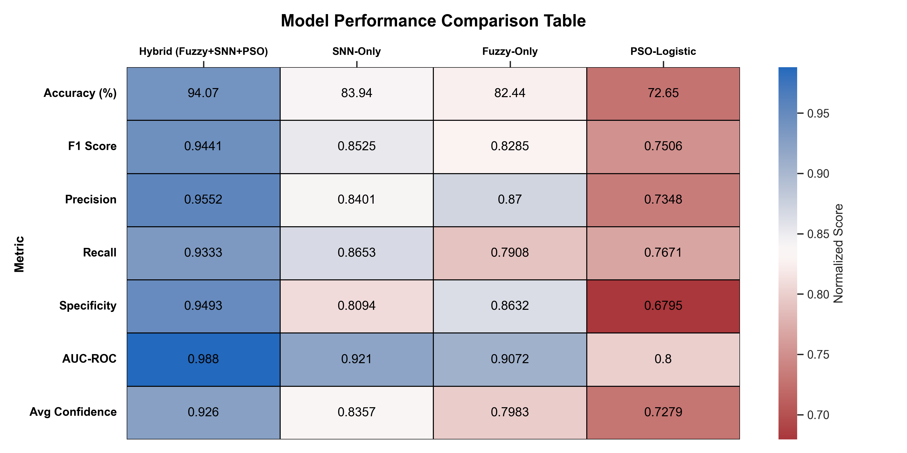
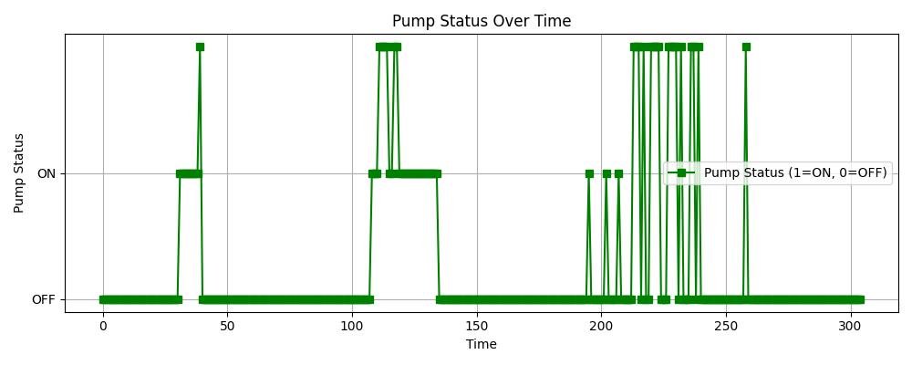
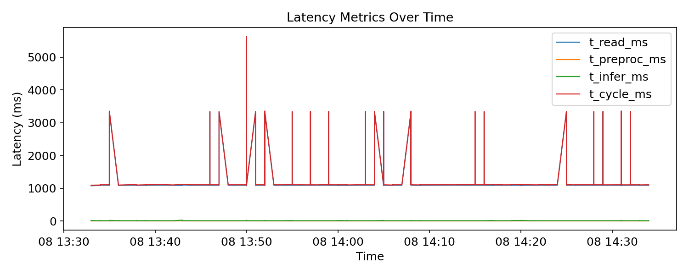

# RootMind-Irrigation: Confidence-Aware Edge AI for Smart Irrigation

This repository accompanies the research paper:

**“Edge-Deployed Fuzzy–PCA–SNN Framework with PSO Optimization for Confidence-Based Irrigation Control”**

The project presents a **lightweight, interpretable, and confidence-aware irrigation controller**
designed for **real-time deployment on Raspberry Pi–class embedded hardware**.

---

## Problem Motivation
Most IoT-based irrigation systems rely on fixed thresholds or cloud-heavy ML models.
These approaches:
- fail under nonlinear soil–water dynamics,
- lack interpretability,
- and are unsuitable for low-power edge devices.

This work addresses these limitations by combining **fuzzy logic, dimensionality reduction,
and neuromorphic inference** into a single embedded controller.

---

## Proposed Method (High-Level)
The system integrates four key components:

1. **Fuzzy logic**  
   → Interpretable Dry / Moist / Wet representations of sensor data  
2. **Principal Component Analysis (PCA)**  
   → Compact 30-dimensional embedding for edge efficiency  
3. **Spiking Neural Network (SNN)**  
   → Low-latency, energy-efficient inference  
4. **Particle Swarm Optimization (PSO)**  
   → Automatic tuning of SNN hyperparameters  

The output is a **confidence-aware ON/OFF irrigation decision**, deployed directly on a Raspberry Pi.

>  Full mathematical formulation and training details are provided in the paper.

---

##  Experimental Setup
- **Offline training:** Public IoT agriculture dataset (~100k samples)
- **Deployment:** Raspberry Pi 4 with soil-moisture, temperature, humidity, and rain sensors
- **Evaluation:** Four real soil-hydration scenarios (wet, moist, dry, rainfall)

---

##  Key Results
**Offline performance:**

| Model | Accuracy | F1-score | AUC |
|------|----------|----------|-----|
| Fuzzy-only | 82.44% | — | — |
| SNN-only | 83.94% | — | — |
| PSO-Logistic | <73% | — | — |
| **RootMindAI (Fuzzy-PCA-PSO-SNN)** | **94.19%** | **0.945** | **0.988** |

**Deployment results:**
- Stable ON/OFF decisions across all soil conditions
- Confidence typically **> 0.95**
- **No oscillatory pump switching**
- **100% irrigation suppression during rainfall**
- Inference latency ≈ **8 ms** on Raspberry Pi

---

##  Edge Deployment Highlights
- Fully on-device inference (no cloud)
- Confidence-gated actuation to avoid uncertain decisions
- Fail-safe pump control
- Suitable for greenhouses and small-scale agriculture

Only a small sample file is included in this repository:
`data/sample/dataset_sample.csv`.

The full dataset is not shared in the repo due to size/licensing constraints.

## Offline Results (Evidence)

## Offline Results (Evidence)

The following figures summarize the offline training behaviour,
classification performance, confidence-aware decision stability,
and deployment characteristics of the proposed RootMindAI framework.
## Offline Training and Edge Deployment Results

The following figures summarize offline training behaviour, confidence-aware
decision stability, and real-time edge deployment characteristics of the
proposed RootMindAI framework.

### Offline Training Dynamics

### Confidence-Aware Decision Analysis

### Edge Deployment Results

<b>Additional Offline and Deployment Figures</b>

Supplementary offline analysis and deployment evaluation figures
(across multiple soil and environmental scenarios) are available in:

- `assets/offline_results/`
- `assets/deployment_results/`

---
## 👤 Author
**Uma Shankari Kalaiarsan**  
Master’s Researcher – Digital Anti Aging Healthcare  
Inje University, South Korea
